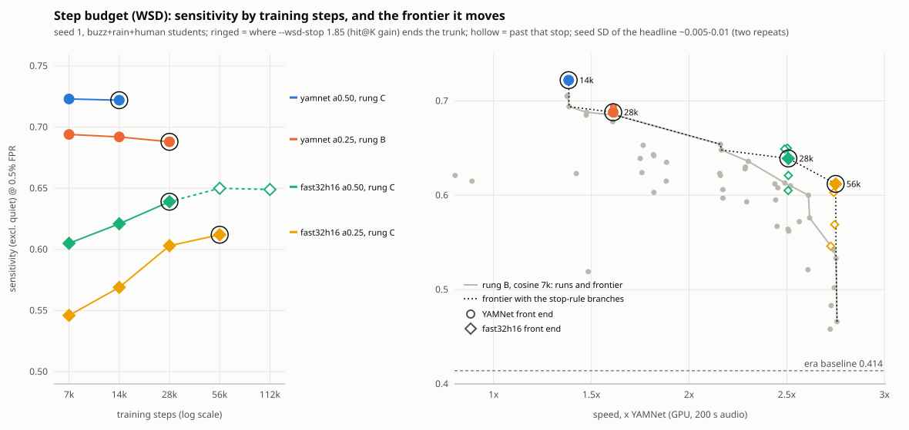

# Front-end frontier (05_distill), started 2026-09-29

Handoff-grade record: enough for a fresh agent to resume. Read `DESIGN.md` (contract),
`LADDER.md` (data-size ladder) and `README.md` (scripts) first; this file covers what came after.

## Why this exists

Luke wants **tiers of models**: a *standard* (the teacher, or the a0.50 student, per later metrics) and a
*lite* (faster, less sensitive). Goal stated 2026-09-29: **explore the speed / sensitivity frontier, no fixed
target**. "4x faster for half the sensitivity" was only an illustration; losing up to ~50% of the baseline's
sensitivity is fine *if speed improves*. Floors from LADDER.md still print, but the sensitivity floor
(headline >= 0.207 = 50% of the moderate baseline's 0.414) is the only one that matters now; the
"1.5x YAMNet at 200 s" floor is superseded by the frontier itself.

## State of the data-size ladder (closed, do not resume)

`05_distill/data/ladder.jsonl`, rung B seed 1 (headline = `sensitivity_exclquiet` @ fpr 0.005, 5 rotating folds):

| run | headline | x YAMNet 20 s / 200 s |
|---|---|---|
| a0.50 (YAMNet front end, layer-wise refit init) | 0.625 | 1.47 (bench) / - |
| a0.50_d12 (layers 13-14 removed) | 0.623 | 1.61 / 1.42 |
| a0.375 | 0.519 | 1.67 / 1.48 |

A->B advanced (0.51 -> 0.625), B->C did not (0.608), so by the LADDER rule rung D never runs. `chain_ladder2.sh`
was **killed by hand at its streaming-loader sanity check** (that check exists only to validate the loader
rung D needs). `lad_B_s1_stream` in `05_distill/data/runs/` is an unfinished leftover. Comparison points: baseline
0.414, teacher honest rotation 0.574, teacher ONNX via harness 0.692 (inflated: trained on those folds).
Students never see labels or eval deployments, but inherit fold knowledge through the teacher: 0.62 is not
"better than the teacher".

## Finding 1: speed is set by the front end, and by FFT length

`chain_frontier_speed.sh` (random weights, engine venv, GPU, x YAMNet; results
`05_distill/data/arch_fe/` and `arch_fe2/` (`_shared/arch_fe*` after `migrate_layout.py`), `time_20.txt` / `time_200.txt`). YAMNet's own front end alone is 1.65x at 200 s, so no
YAMNet-front-end student can beat that. Front-end cost tracks **FFT length** (bands barely matter):
fft 256 ~2.7-3.1x, fft 512 (YAMNet) 1.65-2.0x, fft 1024 ~0.95x, fft 2048 ~0.45x. Any front end with a window
long enough to resolve a ~200 Hz fundamental (fft >= 1024) is *slower than YAMNet*. Lowering the frame rate
(hop 16 / 32 ms, 60 / 30 frames per patch) also helps. At 200 s (a0.50 / a0.375 / a0.25 trunk):
`fast32h16` 2.50 / 2.61 / 2.75, `fast32h32` 2.33 / 2.45 / 2.59, `fast32` 1.53 / 1.73 / 1.99,
`twofast32` 1.76 / 1.82 / 1.87, YAMNet front end 1.37 / 1.48 / -. `fast16` (16 bands) is *slower* than `fast32` with a trunk
(odd small-tensor kernel behaviour; unexplained). Timings taken under some CPU contention: repeat before quoting.

## Finding 2: band profile (`band_profile.py`)

Teacher-called buzz frames vs clean-negative frames, mean log-mel per YAMNet band: buzz frames are *quieter*
in every band and the standardised difference is nearly flat across frequency (d ~ -0.6..-1.2; ~66% of |d|
mass below 2.5 kHz, ~83% below 4 kHz). No narrow buzz band. Crude (mean level only, teacher-defined labels);
it does not rule out band-limited front ends, but gives no reason to expect a big win from them.

## The code

- `frontends.py`: `FRONTENDS` registry. A `Frontend` = channels (each: window, bands, fmin, fmax, fft) + `hop`
  (must divide 15360; frames per patch = 15360/hop). Channels stack as conv input channels and share band count.
  Numpy `mel_patches` (cache builder) and Keras `make_features_layer` (deployed graph), both continuous STFT then
  cut into patches, mel matrix = `tf.signal.linear_to_mel_weight_matrix`. `python 05_distill/frontends.py`
  describes every spec. `test_frontends.py` checks numpy vs Keras vs YAMNet's own layer (all < 3e-5).
- `student.py`: `build_student(..., frontend=name)`; `'yamnet'` is the untouched original path.
- `cache_fe.py`: decodes each slice that already has a targets npz and writes `mel` only to
  `<distill_cache>/_mel/<spec>/...` (float16 (n, frames, bands, channels); before 2026-09-29 the chains wrote
  `<teacher cache>/_fe/<spec>/`, which readers still find and `migrate_layout.py` moves). It stamps each spec dir with
  a fingerprint of the spec, so editing a spec without renaming it now stops the next run. Teacher `code`/`logits` are reused (they do not
  depend on the student front end). `check_cache_align.py`: numpy 'yamnet' spec vs stored mel agrees to ~2e-3
  except a few first-window elements of some mp3 slices (decode start effect, negligible).
- `distill_train.py --frontend X`: packs shards to `05_distill/data/shards/<rung>__<X>` (mel from `_mel`, targets
  from the main cache). In-memory loader only. `--arch` gained `a0.25`.
  **Init:** a non-YAMNet front end cannot use the layer-wise refit (it pairs activations position by position,
  and the frequencies at those positions differ), so `--init yamnet` silently becomes `select` (channel
  selection + BN recalibration). Layer 1 gets YAMNet's kernel split across input channels. The **control run**
  (YAMNet front end, `--init select`) measures what that init change alone costs.
- `export_student.py export` reads the run's `frontend` from `curve.json`; `samples_min` = 15360 - hop + max window.
  ONNX vs Keras parity checked at 4e-6 (two-channel spec).
- `ladder_record.py`: rows now carry `frontend` and `init`; ladder-rule maths ignores non-YAMNet-front-end and
  init-control rows. `ladder_record.py frontier` prints every rung-B run by 200 s speed with headline and % of baseline.
- `bench_arch.py` names: `a0.50@two32` (trunk on front end), `fe@two32` (front end alone), `a0.25` etc; `--out DIR`.

## Running job (as of 2026-09-29 ~13:55; the handoff: enough to resume or take over)

One job runs everything, `main.py`. It runs from the **`distill-lite` worktree** (`.claude/worktrees/distill-lite`, checked out at
the same commit as `main`), on purpose: the job re-reads its python scripts at every stage, so editing `05_distill/*.py` in the
main checkout during a run would change it mid-flight; the worktree is a frozen copy for as long as the job lives (docs are
safe anywhere). Data and logs are shared: they live in the main checkout's `05_distill/data/` whichever worktree runs.

```bash
cd /home/luke/projects/buzzdetect-training/.claude/worktrees/distill-lite
tools/launch_job.sh /home/luke/projects/buzzdetect-training/05_distill/data/main_stage5.log -- \
  /home/luke/anaconda3/envs/buzzdetect-train/bin/python 05_distill/main.py --rung B --runs "fast32h16:a0.25 fast32h16:a0.25:lam=0 \
  fast32h16:a0.25:classes=ins_buzz+ambient_rain+human fast32h16:a0.25:classes=ins_buzz+ambient_rain+human:lam=0 \
  twofast32:a0.50 fast32h16:a0.375 fast32h32:a0.25 two32:a0.50 lo32:a0.50 twofast32:a0.375 fast32lo:a0.50 fast32h16lo:a0.50"
```
(launch_job pid 2028505, started 2026-09-29 13:50; log `05_distill/data/main_stage5.log`; stage lines `[chain] <label>: start/done/FAILED`.)
Order: the class-subset experiment first (below), then the rest of the frontier list. 12 runs; the small a0.25 runs take ~15-20 min
end to end (the first, `fe_B_fast32h16_a0.25_s1`, took 18 min), the a0.50 ones 40-60 min, plus ~25 min of shard packing for each
front end not packed yet (two32, lo32, fast32lo, fast32h16lo): **ETA about 6-9 h, i.e. ~20:00-23:00 on 2026-09-29**. One GPU job at a
time (4 GB card): do not start another. When it finishes, `git -C .claude/worktrees/distill-lite merge --ff-only main` refreshes the runner.

- **Resume / restart:** rerun the same command (or a shorter `--runs`): finished stages skip, an interrupted training resumes from
  its last checkpoint (every 2000 steps). A failed stage stops the job with `[chain] <label>: FAILED exit N` and a nonzero
  `[launch_job] exit`; read the log above it. `main.py --dry-run` with the same `--runs` shows done/pending per stage.
- **Cancel:** `kill` the launch_job pid and its `main.py` / `distill_train.py` children by PID (never `pkill -f`, see CLAUDE.md).
- The chains that ran before (`chain_frontends*.sh`, pre-generalization) were killed by hand at 13:27 (`twofast32` packed, just starting
  to train); their runs' data are all recognised by `main.py`. They are kept as the record; do not relaunch them (they hard-code
  the old `05_distill/data` layout). `main.py` itself was killed once at ~13:49 (a run had just started) to move the data root.
- **Where things live now:** data root `05_distill/data/` (gitignored, like `02_set`'s data; formerly `05_distill/data/`), per teacher
  `05_distill/data/v4-ft-ps-e60-moderate/{runs,models,eval,shards,ladder.jsonl}`, timings `05_distill/data/_shared/arch*`; teacher
  targets and spectrograms under paths.local.json's `distill_cache` (`/media/server storage/distill-cache`, with `_mel/<spec>` shared
  and `v4-ft-ps-e60-moderate/` per teacher). `migrate_layout.py` moves any older layout to this one.
- **Branch state:** everything is merged into `main` (the generalization, the class options, the data-root move, and the
  earlier uncommitted int8-ptq/log-viewer work, committed as `342ac6c`). `distill-generic` no longer exists. Nothing is pushed.
  The main checkout's `paths.local.json` gained `audio_root` and `distill_cache` (the worktree copies already had them).
- Disk: `05_distill/data` was 106 GB (46 GB of it the closed rung-C pack, `shards/C`, rebuildable and safe to delete; per-front-end
  B/V packs are 1-8 GB each) on the 937 GB SSD with ~330 GB free; the remaining runs add ~35-40 GB.

## Results so far (append as runs land; `ladder_record.py frontier` is the source of truth)

- 2026-09-29 (rung B, seed 1, 7000 steps, a0.50 trunk, init select, headline `sensitivity_exclquiet` @ fpr 0.005; speed x YAMNet at 200 s):
  `fast32h32` **0.572** at 2.56x, `fast32h16` 0.562 at 2.51x, `fast32` 0.606 at 2.17x, against the YAMNet-front-end control 0.694 at
  1.39x. So the faster front ends cost ~0.09-0.13 headline for ~1.6-1.8x more speed, all still ~136-146% of the 0.414 baseline (floor
  0.207). Band-placement twins, `twofast32`, the smaller trunks and the class-subset runs are still to come.
- 2026-09-29 09:48 control `fe_B_yamnet_a0.50_s1_select` (YAMNet front end, `--init select`): headline **0.694**
  (incl. quiet 0.580) vs 0.625 for the same model with the layer-wise refit init. So the simpler init did not hurt
  (it scored higher; one seed, a 0.07 gap is well above the ~0.02 noise, so the refit is not helping at 7000 steps).
  Compare new front ends against **0.694**, not 0.625.

## Class-subset experiment (2026-09-29, queued in the relaunched main.py job)

Question: does distilling only `ins_buzz`, `ambient_rain`, `human` (and/or dropping the code-regression loss)
buy buzz sensitivity at a small width, where the frontier's sensitivity is lost (a0.375 = 0.519 vs a0.50 = 0.625 on
the YAMNet front end)? Not a speed lever by itself (the 15-way head is ~8 kFLOPs). Runs on the cheapest front end
and width, `fast32h16:a0.25` (init `select`, rung B, seed 1, 7000 steps), so they compare directly with that run's
full-class result (`fe_B_fast32h16_a0.25_s1`, in the standard list): `lam=0` (`..._lam0`), classes only
(`..._c-buzz-rain-human`), and both (`..._c-buzz-rain-human_lam0`). Read gaps below ~0.03 as ties (seed noise ~0.02,
one seed each). Caveat the other way: the other classes are supervision too (jets and machinery teach the trunk
what confounders look like, and jet false positives at 1_95 are a known problem), so a buzz-only student might gain
sensitivity and lose false-positive behaviour; the headline holds fpr fixed, so it would show up as a lower
headline, not a separate number. If the subset wins, the next step is the same subset at `fast32h16:a0.375`/`a0.50`
and a check of what buzzdetect does with a 3-column model.

## How to read the result / what to decide

Run `conda run -n buzzdetect-train python 05_distill/ladder_record.py frontier`. Questions, in order:
1. Control vs `ladder` a0.50 B (0.625): how much did the init change alone cost? Compare every new front end
   against the *control*, not against 0.625.
2. `fast32` vs `fast32h16` vs `fast32h32`: what does cheaper front end / lower frame rate cost in sensitivity.
3. `fast32lo` vs `fast32`, `fast32h16lo` vs `fast32h16`: pure band-placement effect (same speed).
4. Trunk shrink (a0.375, a0.25) on the best fast front end: where does sensitivity fall under 0.207.
5. Frontier = non-dominated (speed, headline) points; the lite tier is a choice along it (Luke's call).
Noise: A-rung repeat spread on `lost_pct` was 1.31 points; headline seed noise on the 5 folds is ~0.01-0.02 (see
memory noise-floor-cv). One seed per run, so read gaps below ~0.03 as ties.

## Caveats

- Eval scores each frame alone with zero padding (`eval_folds.py`), while training patches use real audio after the
  frame: slightly pessimistic for long windows (two32/lo32, `twofast32` ch0).
- Headline is `sensitivity_exclquiet` at fpr 0.005 of the student's own ONNX, not of the full pipeline.
- Speed here is random-weight ONNX on the GTX 1650 via the buzzdetect engine session (bench_arch harness). CPU numbers are
  informational (i7-2600, no AVX2).
- Not done / not planned: pruning always-zero output channels, non-uniform widths, a learned (conv) front end,
  int8, dropping more layers beyond d12, seeds beyond 1, rung C+ data for a front end. `IDEAS.md` has none of these yet.
- Nothing here is shipped to buzzdetect. Export writes only under `05_distill/data/models/`. Shipping is Luke's call.

## Where things live

Checkpoints and curves `05_distill/data/runs/<name>/`; ONNX `05_distill/data/models/<name>/`; eval
`05_distill/data/eval/<name>/folds_sx.csv`; table `05_distill/data/ladder.jsonl`; caches under the `distill_cache` path
(`_mel/<spec>/`, formerly `_fe/<spec>/`); shards `05_distill/data/shards/`. Per-teacher locations are `05_distill/data/<teacher>/...` once migrated (README.md). All of `.local/` is gitignored and lives in the main checkout.
Code is in the `worktree-distill-lite` worktree, uncommitted as of this writing.

## Update 2026-09-29 (evening): eval bug fixed, class-subset result

- **Bug:** `eval_folds.infer` had a loop variable `buzz` shadowing the buzz column index (introduced with `--classes`, 13:23), so
  predictions stored empty activations and every eval after that had NaN sensitivity. Fixed on branch `worktree-fix-eval-buzz-shadow`
  (not merged to main). The 12 affected evals were repaired from their saved `logits.npy` and re-scored; ladder rows patched.
- **Class-subset (ins_buzz + ambient_rain + human), fast32h16, rung B, seed 1, headline / 200 s speed:**
  a0.25 0.533 vs 0.483 full-class (2.75x); a0.375 0.576 vs 0.521 (2.62x); a0.50 0.610 vs 0.562 (2.52x).
  Consistent +0.05 at every width, above seed noise (~0.02), so the subset helps. `lam=0` hurts (0.466 full / 0.502 subset at a0.25).
  Speed is unchanged. Unmeasured: false-positive behaviour beyond the fixed-FPR headline (jets at 1_95).
- **Front-end twins:** `lo` band placement ties its twin (fast32lo 0.597 vs 0.606; fast32h16lo 0.564 vs 0.562). `twofast32`
  (0.624 at a0.50) is slower (1.76x); `two32`/`lo32` are slower than YAMNet (0.80x/0.89x) for no gain.
- **buzzdetect and 3-column models (read from `engine/src`, not run):** classes come from `config_model.json`; precision mode needs the
  model's own tests/metrics threshold table. Loading a subset student in the engine is untested.

## Update 2026-09-30: 1_95 jet probe

`eval_folds.py probe` (and a `probe` stage in `main.py`, after `eval`) scores `1_95` apart from the headline. It is a
training fold, so this is an overfitting-tolerant check on the jet false positives, not a held-out number. Output:
`eval/<name>/probe/{folds_sx.csv,probe.json}`. The jet frames are the ones labelled `mech_plane` (the cache is per label
combination, so the flyover's snips can't be isolated). Backfilled for all 29 finished students.

- 1_95 sens@fpr0.005 runs 0.03-0.32 across the ladder. It tracks headline and speed (slowest, yamnet-trunk/twofast32 students best,
  0.29-0.32; fast32h16 a0.25 worst, 0.03-0.11). Class subsets help here too (a0.50 fast32h16 0.134 -> 0.200).
- Jet frames are 36-76% (typically ~55%) of the ~178 threshold-setting false positives in every student. No student rejects them.
- Not measured: the teacher on the same probe (baseline for "did distillation make it worse").

## Update 2026-10-04: step-budget curves (WSD, `chain_wsd.sh`)



`tools/human/wsd_svg.py` draws it from `ladder.jsonl` and each run's `curve.json`. Seed 1, buzz+rain+human students.
Stop rule: `--wsd-stop 1.85`, the rung-A hit@K repeat spread. The trunk ends at the first branch whose hit@K gain on
the previous budget is under that. Headline seed noise is ~0.01-0.02 (two rung-A repeats only), so a single step
of 0.01 here is not a finding.

    trunk                         7k     14k    28k    56k    112k   (headline; * = the rule's last branch)
    yamnet a0.50, rung C          0.723  0.722*
    yamnet a0.25, rung B          0.694  0.692  0.688*
    fast32h16 a0.50, rung C       0.605  0.621  0.639* 0.650  0.649   (run past the stop on purpose)
    fast32h16 a0.25, rung C       0.546  0.569  0.603  0.612*

- **YAMNet-trunk students are flat from 7k.** Both stop at the first chance (a0.50: +0.7 hit@K, a0.25: +2.3 then
  +1.0) and the headline does not move (0.723 / 0.722; 0.694 / 0.692 / 0.688). 7k is enough for them.
- **fast32h16 students keep learning to ~28-56k.** a0.50 gains 0.045 from 7k to 56k, then 112k adds nothing
  (0.650 / 0.649; hit@K 64.8 / 65.1). The rule stops it at 28k (hit@K +1.1), 0.011 short of the 56k point:
  inside seed noise, so the rule's stop is acceptable but not proven right. a0.25 is still rising slowly at
  56k (+0.009 over 28k), where the rule stops it.
- **Equivalence holds:** a 7k WSD branch matches the 7k cosine run at rung B, so the curves can be read
  against every earlier ladder number. Headline 0.713 vs 0.705 (yamnet a0.50), 0.607 vs 0.610 (fast32h16 a0.50),
  0.694 vs 0.685 (yamnet a0.25); mae_live 0.178 / 0.201 / 0.188 vs 0.181 / 0.203 / 0.191; hit@K within the
  1.85 spread (+0.5, -1.7, -1.2). lost% at logit 0 is 2-6 points worse for the WSD branches: the calibration
  offset again, not ranking. No lr retry needed.
- **Frontier (right panel):** fast32h16 a0.50 at 28k (0.639, 2.5x) and fast32h16 a0.25 at 56k (0.612, 2.75x)
  beat the best rung-B 7k student at their speed (0.613 at 2.49x, 0.542 at 2.74x): +0.03 and +0.07. The YAMNet-trunk end
  does not move (14k/28k are no better than 7k). A proper rung-C frontier (each student at its own budget under
  the rule) is the next step, as the old handoff planned.
- **LADDER.md's "B to C did not advance" was a step-count confound, half confirmed.** At equal 7k steps, rung C
  ≈ rung B (yamnet a0.50 0.723 vs 0.713; fast32h16 0.605 vs 0.607): C's 4x more data does nothing when each
  frame is seen 1.2 times instead of 4.8. Given steps, C gets fast32h16 to 0.650. What is not measured is a
  56k run at rung B, so how much of that gain needs C's data, rather than just more passes, is open.
- **hit@K as the stop signal:** r with the headline 0.941 over 33 buzz+rain+human runs (hit% at logit 0: 0.957),
  0.878 over all 68 (0.887). As good a proxy as hit% at 0, not better; it is kept because it is calibration-blind.
  Ten rung-B runs are scored on the clean V pool and the rest on the old one (below), so these r are approximate.
- Not yet done: the held-out test set on the 7k/28k/56k/112k fast32h16 a0.50 branches (Luke, when back).

**Test-set contamination found while checking the backfill; being redone (Luke: retrain everything).** The 2026-10-02 re-plan
(`c5551d1`) blacklisted the SeeNote out-of-sample test set: `Luke - Pollinator Habitat/2025-07-11/gru` and
`Luke - Diel Drivers/2026-08-18`. `distill_train.pack()` trusts any pack without a fingerprint, so the older packs
were never rebuilt:

- Training packs A, B, B__fast32/h16/h32/twofast32 (and the B__*lo packs, fingerprinted before the re-plan) and
  **C (yamnet)** hold `gru` slices. Every rung-B student, the rung-B WSD runs and the two yamnet rung-C WSD
  branches trained on test-set audio. `C__fast32h16` was built after the re-plan: **the fast32h16 rung-C branches
  trained clean**, so those are the ones to take to the held-out test.
- V packs V, V__fast32/h16/h32/twofast32 hold 22 slices of 2026-08-18 (never trained on, but they fed the
  hit@K stop decisions). The current plan swaps them for 22 other slices, and the packs rebuilt since have that pool.
  So when `backfill_hitk.py` rebuilt the V packs for fast32lo, lo32, two32 and fast32h16lo, it scored 10
  rung-B runs on a different pool (`RECOUNT DIFFERS`): at first 22 slices short (their mels were never cached),
  then, after `cache_fe.py --rung V` filled them, the same frame count by coincidence (teacher buzz 7,415, not
  7,685). Those 10 runs carry clean-pool hit@K. `backfill_hitk.py` now refuses to write when the frame
  count or the teacher's buzz count differs.

The fix (2026-10-04): `pack()` now rebuilds any pack without a fingerprint and refuses an incomplete V pool.
`quarantine.py` moved the 64 affected runs (runs, models, eval, ladder rows) to
`data/<teacher>/_contaminated_2026-10-02/`, with a manifest of their args. `chain_clean.sh` refills the caches
for the clean plan, re-scores V on the 9 clean fast32h16 rung-C branches (`backfill_hitk.py --rescore`), and
retrains every quarantined run on rebuilt packs (~45 h). Every number above is from before the fix; the
retrained ones replace them as they land.
